# Deriving a Cost Model for the IBM Spyre Accelerator

*Working draft. This is the long-form DERIVATION: how each term of the model was arrived
at, starting from an observation in the sweep data, then a question, a hypothesis, an
isolation experiment, and the resulting model form — validated offline with
`notes/eval_model.py` against the stored measured times (no re-run needed to re-score).
Every section follows that same arc.*

*Section skeleton — filled in iteratively, one section at a time; figures are generated
by `notes/plot_report.py` from `sweep_records.json`.*

---

## The ops we test, and the model at a glance

This section is the **destination**; Parts I–IV are the route — each term below is *derived*
from the data in the section noted, starting from an observation. Read this for the shape of the
whole model, then the Parts for why each piece takes the form it does.

### The harness ops (what each benchmark actually runs)

| group | ops | torch expression |
|---|---|---|
| pointwise | `neg` `gelu` `exp` `mul` `add` `copy` | `-x`, `gelu(x)`, `exp(x)`, `a*b`, `a+b`, `x+1.0` (`copy` is a broadcast op) |
| pointwise n-ary | `add3` `add4` | `a+b+c`, `a+b+c+d` (2 / 3 chained adds) |
| reduction | `sumrow` `sumcol` `amax` `mean` `sumall` `read` | `sum(x,dim=1)`, `sum(x,dim=0)`, `amax(x)`, `mean(x,dim=1)`, `sum(x)`, `x` (pure read) |
| broadcast | `bcast` `mulbcast` `bcastcol` `write` | `a[R,C]+b[1,C]`, `a[R,C]*b[1,C]`, `a[R,C]+b[R,1]`, `b[1,C]+c[R,1]` |
| transport | `transpose` `transpose_outer` `cat0` `cat1` | `[R,C].transpose(0,1)` (stick dim swapped into a row); `[R,8,C].transpose(0,1)`→`[8,R,C]` (swap the two **outer** axes, inner 64-stick `C` kept); `cat([x,x],dim=0/1)` |
| matmul | `mm` `mmwd` | `a@b` (planner split / forced `WD_M×WD_N×WD_K` split) |
| coarse-tiling | `softmax_row_tiling` `matmul_row_tiling` | `softmax(x,dim=-1)`, `a@b` — tiled so an intermediate stays in LX |

### The model — full form

Per kernel, with `R`, `W` = HBM bytes read / written. Every term is shown; each is 0 / 1 when it
does not apply. The right column names the section where it is derived.

```text
T   = compute + mem − γ·min(compute, mem)          mem = HBM / (eff · s_lx)

  HBM     = [ (R+W)/BW + α·min(R,W) ] · (n-ary derate)  +  spill  +  write_extra
  compute = MACs / cores / (peak · pt_eff)
  s_lx    = min(1, (512KB / ws)^0.15)   for a coarse-tiled kernel with ws > 512KB   (else 1)
```

| term | form | derived in |
|---|---|---|
| `(R+W)/BW` | `BW` = 150 (pointwise / matmul); `BW_red(ROWS)=min(150, 114+61·e^(−ROWS/3700))` (row-reductions); per-op `BW_eff` for access-pattern ops | §1, §5, §6, §8 |
| `α·min(R,W)` | `α = 0.00574 ns/B` — read↔write bus **turnaround** (0 for one-directional traffic) | §2 |
| n-ary derate | `× (1 + 0.075·(n_ops−1))` — multi-pass pointwise chain (`add3/add4`) | §3 |
| `spill` | `(A_bytes+B_bytes)·f(area)`, `area=(M/m)·(N/n)`, `f=min(1.5, max(0, 0.45·log₂(area/65536)))` — matmul operand **re-read** when the per-core output tile overflows on-chip capacity | §11 |
| `write_extra` | `2.148e-7·ROWS^1.6·COLS^2.2` (÷BW) — `write` outer-product, empirical | §4 |
| `compute` | `MACs / cores / (peak · pt_eff)`, `peak = 1140 MAC/ns/core`; 0 for non-matmul | §9 |
| `pt_eff` (derates **compute**) | systolic-array fill: `min(1,(rows/64)^0.35)` (`rows` = per-core rows); a coarse-tiled matmul's extra per-tile underfill is flagged, not modeled (`pt_eff=1`) | §9, §15 |
| `eff` (derates **memory**) | `min(0.95, (h/13)^0.68)`, `h = per-core tile height = ROWS/(cores·tiles)` — streaming-pipeline fill, coarse memory-bound | §15 |
| `s_lx` (derates **memory**) | `min(1, (512KB/ws)^0.15)` for `ws > 512KB` (coarse-tiled), `ws = 2·(rows/core)·COLS·2B` — per-core working set overflows LX; spilled traffic runs slower | §14 |
| `γ·min(compute,HBM)` | `γ = 0.46` — compute/HBM **overlap** (0 when `compute=0`) | §10 |

Per-op `BW_eff`: `restickify` (transpose) `=116`; `stick_scatter` (cat0) shape-dependent
`252 − 4·log₂R − 12.3·log₂C` clamped [45, 150]; `reduce_outer` (sumcol) `=113`; `broadcast`
(`copy`/`bcast`/`bcastcol`/`mulbcast`) `=118`. The planner always keeps `K` whole (`WD_K=1`).

---

## Part I — Pointwise: the gold baseline

### §1. Pointwise kernels are memory-I/O bound

Pointwise ops are the simplest kernels on the device: read one or more tensors, apply an
elementwise function, write one tensor. We use them to establish the reference every later
op is measured against.

**Observation 1 — time is linear in bytes, with no fixed cost.** Sweeping the balanced
1-read/1-write op `neg` (and `gelu`, `exp`) across sizes, the kernel time is a straight
line in the HBM bytes moved (device / stick-padded), passing through the origin:

| op | R×C | HBM traffic | kernel |
|---|---|---|---|
| `neg` | 2048×1024 | 8.4 MB | 77.6 µs |
| `neg` | 2048×4096 | 33.6 MB | 320.8 µs |
| `neg` | 4096×4096 | 67.1 MB | 646.6 µs |
| `neg` | 2048×16384 | 134.2 MB | 1314.3 µs |

A linear fit `T = a·bytes + b` over the 1R:1W set (16 points, 8.4–134 MB) gives
**R² = 0.99996**, slope → **~102 GB/s**, and intercept **b = −7 µs ≈ 0** (−9 % of the
smallest kernel — no *positive* per-kernel floor).

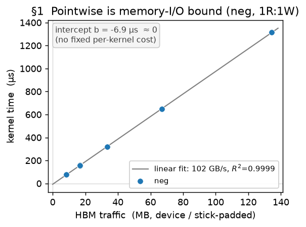

**Observation 2 — the arithmetic is free.** `gelu` and `exp` (a transcendental) land within
~1 % of `neg` at every size (e.g. at 8.4 MB: 78.3 / 77.1 / 77.6 µs; at 134 MB:
1312.7 / 1314.5 / 1314.3 µs). Doing real math costs the same as negating → **there is no
compute term**; the kernel time is set entirely by moving bytes.

**Model (baseline).** `T = bytes / BW` — no compute term, no fixed per-kernel cost. This
is the gold reference. One thread is deliberately left for the next section: the fitted rate here is
~102–108 GB/s, *below* the read-only peak (~150) — i.e. the effective BW is **not** a
single constant; it depends on the read/write mix (§2).

### §2. The read/write ratio changes the effective bandwidth

**Observation — the effective BW is not a single constant.** §1's fit gave ~102–108 GB/s
for `neg`, but a read-dominated op runs far *faster* per byte. Grouping ops by their
read/write mix (effective BW = `(R+W)/time`, and `w = W/(R+W)` the write fraction):

| class | example op | `w` | effBW |
|---|---|---|---|
| read-dominated | `sumrow`/`read`/`amax` (reduce → tiny write) | ~0 | ~150 GB/s |
| 2 reads : 1 write | `add`/`mul` | 0.33 | ~116 GB/s |
| 1 read : 1 write | `neg`/`gelu`/`exp` | 0.50 | ~108 GB/s |
| write-dominated | `write` = `b[1,C] + c[R,1]`: both inputs broadcast → tiny reads, full write | ~1 | ~144 GB/s |

So `bytes/BW` with one BW is wrong — the effBW falls as the traffic becomes balanced, then
climbs back toward write-only.

**Question.** What makes balanced traffic slower per byte than one-directional traffic?

**Hypothesis.** HBM is a shared bus that pays a **turnaround** cost when it switches
between reading and writing. The penalty falls on the overlap `min(R,W)`, which is 0 for
pure read or pure write and maximal at a balanced 1:1:

```
T = (R+W)/BW_peak + α·min(R,W)      ⇒   effBW = 1 / (1/BW_peak + α·f),  f = min(R,W)/(R+W)
```

This predicts a **symmetric valley** in effBW vs `w`: the peak rate at `w=0` and `w=1`,
the minimum at `w=0.5`.

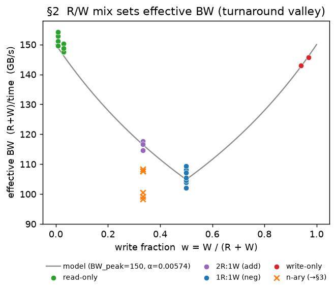

Each class is one op swept at several sizes, so each shows several points; the small
vertical spread within a class is a mild size drift (~2–3 %). Two things to read off the
plot: (a) the two ends of the valley reach the **same height** — read-dominated (~150) ≈
write-dominated (~144) — so reads and writes share **one** rate, and a single `BW_peak` is
right (not separate read/write rates); (b) the `n-ary` crosses (`add3`/`add4`) sit at the
same `w=0.33` as `add` but **below** the curve — they do not fit this two-parameter model,
which is the subject of §3.

**Model.** `T = (R+W)/BW_peak + α·min(R,W)`, with `BW_peak = 150`, `α = 0.00574 ns/B`.

### §3. Chained pointwise ops pay a per-op derate

**Observation.** In §2's figure, `add3`/`add4` sat *below* the turnaround valley curve in §2 — they run
slower per byte than a single `add`, and it worsens with each extra operand.

**Why: the hardware add is binary.** The loop-level IR only fuses a **2-input → 1-output**
add, so an n-input sum compiles as a **chain of binary adds**, each writing an intermediate
that the next reads back:

```
add3:  op0 = arg0 + arg1            add4:  op0 = arg0 + arg1
       op1 = buf0 + arg2  (= out)          op1 = buf0 + arg2
                                           op2 = buf1 + arg3  (= out)
```

With scratchpad planning off every buffer lives in HBM, so each intermediate (`buf0`,
`buf1`) is **written and read back** — and that traffic is already in the byte count:

| op | reads | writes | R | W | `w = W/(R+W)` |
|---|---|---|---|---|---|
| `add` | arg0, arg1 | out | 2 | 1 | 0.33 |
| `add3` | arg0, arg1, **buf0**, arg2 | **buf0**, out | 4 | 2 | 0.33 |
| `add4` | arg0, arg1, **buf0**, arg2, **buf1**, arg3 | **buf0**, **buf1**, out | 6 | 3 | 0.33 |

**The round-trip bytes do not fully explain it.** Every arity has the *same* `w = 1/3`, so
the §2 turnaround model predicts the *same* effective BW (~117 GB/s) for all of them — a flat
line. But the measured effBW **declines**: 116 → 108 → 99 as `add → add3 → add4`. So there is
an extra cost *beyond* the counted round-trip bytes.

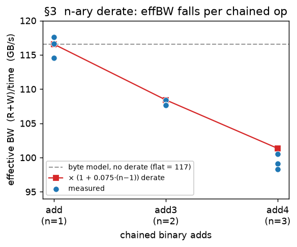

**Model.** The derate grows **linearly** with the number of chained ops, and a linear form is
good enough: `T × (1 + 0.075·(n_ops − 1))` — each extra op adds a flat 7.5 %. It lands `add3`
exactly (base+turn 216 µs × 1.075 = 232 µs = measured) and `add4` within ~2 %, so there is no
need for a higher-order (super-linear) term over the tested arities.

### Part I accuracy — every pointwise data point

Predicted vs measured for all pointwise ops (`T = (R+W)/BW_peak + α·min(R,W)`, with the
arity derate for the chained adds). **RMS 1.9 %, mean −0.2 %, range −3.0…+4.3 %** over
28 points — every point within ~4 %. (`copy` is *not* a pointwise op and is excluded here:
`x + 1.0` lowers to an `add` with a resident broadcast constant, so it is a broadcast op —
its accuracy is reported with the broadcast ops in §4.)

| op | R×C | measured µs | predicted µs | err % |
|---|---|---:|---:|---:|
| `neg` | 512×8192 | 156.6 | 160.0 | +2.2 |
| `neg` | 1024×4096 | 153.4 | 160.0 | +4.3 |
| `neg` | 2048×1024 | 77.6 | 80.0 | +3.1 |
| `neg` | 2048×2048 | 159.1 | 160.0 | +0.6 |
| `neg` | 2048×2048 | 161.3 | 160.0 | −0.8 |
| `neg` | 2048×4096 | 320.8 | 320.0 | −0.3 |
| `neg` | 2048×16384 | 1314.3 | 1280.0 | −2.6 |
| `neg` | 4096×1024 | 160.3 | 160.0 | −0.2 |
| `neg` | 4096×4096 | 646.6 | 640.0 | −1.0 |
| `neg` | 8192×512 | 159.0 | 160.0 | +0.6 |
| `gelu` | 2048×1024 | 77.1 | 80.0 | +3.7 |
| `gelu` | 2048×4096 | 319.1 | 320.0 | +0.3 |
| `gelu` | 2048×16384 | 1314.5 | 1280.0 | −2.6 |
| `exp` | 2048×1024 | 78.3 | 80.0 | +2.2 |
| `exp` | 2048×4096 | 322.4 | 320.0 | −0.8 |
| `exp` | 2048×16384 | 1312.7 | 1280.0 | −2.5 |
| `mul` | 2048×1024 | 108.9 | 108.0 | −0.9 |
| `mul` | 2048×4096 | 433.0 | 431.8 | −0.3 |
| `mul` | 2048×16384 | 1751.6 | 1727.4 | −1.4 |
| `add` | 2048×1024 | 107.0 | 108.0 | +0.9 |
| `add` | 2048×4096 | 431.7 | 431.8 | +0.0 |
| `add` | 2048×16384 | 1757.0 | 1727.4 | −1.7 |
| `add3` | 2048×1024 | 232.2 | 232.1 | −0.0 |
| `add3` | 2048×4096 | 934.4 | 928.5 | −0.6 |
| `add3` | 2048×16384 | 3740.3 | 3713.9 | −0.7 |
| `add4` | 2048×1024 | 375.6 | 372.5 | −0.8 |
| `add4` | 2048×4096 | 1523.1 | 1489.9 | −2.2 |
| `add4` | 2048×16384 | 6146.0 | 5959.5 | −3.0 |

---

## Part II — Other memory-bound ops

### §4. Broadcast: a broadcast operand is read at its small size — and raises the effective BW

A *broadcast* operand is a small tensor (a row `[1,C]`, a column `[R,1]`, or a scalar)
added/multiplied against a full tensor and reused across the broadcast dimension. It has
two effects, both distinct from a plain 1R:1W op.

**(a) I/O counting — the operand is not expanded.** In `bcast` (`a[R,C] + b[1,C]`) the
broadcast operand `b[1,C]` is read at its actual `[1,C]` size (one row of `C` elements) — it is
**not** expanded to `b[R,C]` to match the output. So the kernel reads the full input `a[R,C]`
plus a negligible `[1,C]` operand — about a single streaming pass over `a`, not two full `[R,C]`
reads.

**(b) A broadcast operand raises the effective bandwidth.** At well-filled sizes (ROWS ≥ 2048)
the four broadcast-operand ops run above `neg`'s steady ~105 GB/s in effective bandwidth
(`(R+W)/time`):

| op | effective BW `(R+W)/time` (GB/s), ROWS=2048, COLS 2048–16384 |
|---|---:|
| `neg` (1R:1W baseline) | ≈ 105 |
| `copy` = `x + 1.0` (add a broadcast scalar) | 118–119 |
| `bcast` (`a + b[1,C]`) | 117–123 |
| `bcastcol` (`a + b[R,1]`) | 118–121 |
| `mulbcast` (`a * b[1,C]`) | 115–123 |

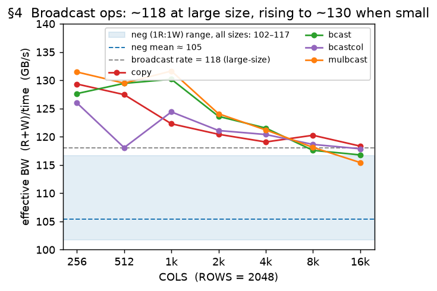

A dedicated COLS sweep confirms it: all four settle at **~117–118 GB/s for COLS ≥ 4096**, and the
three *vector*-broadcast ops (`bcast`/`bcastcol`/`mulbcast`) run **higher at small COLS** — up to
~124–132 at COLS = 1024 — easing to the plateau as COLS grows (`copy`, a scalar broadcast, stays
flat throughout). We sweep **COLS** because the
broadcast operand `b[1,C]` grows with COLS — the axis that could make the operand expensive (and
does, for `write` below); ROWS would not change the operand at all. All four ops (three adds and
a multiply) show the lift, so it is the broadcast operand, not the instruction, that raises the
rate.

**Model.** All four ops get one effective bandwidth, `bw_broadcast = 118 GB/s` (we do not fit per
op). Sweeping down to small `ROWS` and `COLS` shows the rate sits ~130 GB/s while either dimension
is small and settles to 118 only when both are large — a bounded small-operand speedup common to
all four (`copy` included), not a growing trend. So 118 is the large-size rate; small operands are
over-predicted by ~10 %, left as a flagged residual. Why a broadcast operand beats a plain 1R:1W
op is not established — 118 is calibrated, not derived.

**`write` — an outer-product write, modeled empirically.** `write` (`b[1,C] + c[R,1]`)
broadcasts *both* operands. On the device the row operand `b[1,C]` is only `C` elements
(~32 KB even at C=16384) and the column operand `c[R,1]` is stick-inflated to `R × 64` (each
of the R values occupies its own 64-element stick); both are small next to the `[R,C]`
output, so a naive model treats `write` as an output-dominated write. Empirically it is much
slower — its effective bandwidth falls from ~140 GB/s at small/normal sizes to ~56 at large — and
the cost per output byte rises with COLS, and more weakly with ROWS:

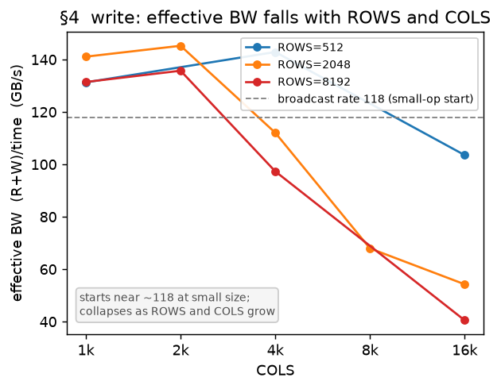

The slowdown is in the **outer-product write** itself: the output device layout is
`[C/64, R, 64]`, so a larger `C` means more column-stick planes and the write becomes less
efficient — the exact mechanism is not yet clear. We charge an **empirical extra HBM cost**, fit
on the write sweep:

```
extra_bytes  =  2.148e-7 · ROWS^1.60 · COLS^2.20   (charged at BW_peak)
```

This brings `write` to ~10 % RMS (broadcast category 19 % → **7.7 %**) — an empirical black-box
for a rare op, to be replaced once the mechanism is understood.

**§4 accuracy — every broadcast data point.** RMS **7.6 %**, mean +2.2 %, over 77 points. The
error budget: `write` (the outer-product black-box, worst −24 %) and the small-operand
over-prediction (~+8…+13 %, since 118 is the large-size rate). One point bucks the trend —
`bcast`/`mulbcast` at `256 × 16384` measure ~95 GB/s (−20 %), *slower* not faster, and
`bcastcol` at that size is fine — so it reads as noise in a single run, queued for a re-measure.

| op | R×C | measured µs | predicted µs | err % |
|---|---|---:|---:|---:|
| `copy` | 2048×1024 | 67.5 | 71.1 | +5.4 |
| `copy` | 2048×1024 | 70.4 | 71.1 | +1.0 |
| `copy` | 2048×2048 | 141.2 | 142.2 | +0.7 |
| `copy` | 2048×4096 | 283.7 | 284.4 | +0.2 |
| `copy` | 2048×4096 | 286.2 | 284.4 | −0.7 |
| `copy` | 2048×8192 | 558.0 | 568.7 | +1.9 |
| `copy` | 2048×16384 | 1131.8 | 1137.4 | +0.5 |
| `copy` | 2048×16384 | 1136.4 | 1137.4 | +0.1 |
| `copy` | 8192×2048 | 604.3 | 568.7 | −5.9 |
| `copy` | 16384×2048 | 1230.8 | 1137.4 | −7.6 |
| `copy` | 16384×4096 | 2473.0 | 2274.9 | −8.0 |
| `bcast` | 64×16384 | 34.5 | 35.8 | +3.9 |
| `bcast` | 256×16384 | 180.6 | 142.5 | −21.1 |
| `bcast` | 2048×1024 | 64.8 | 71.1 | +9.8 |
| `bcast` | 2048×2048 | 136.3 | 142.2 | +4.3 |
| `bcast` | 2048×4096 | 278.5 | 284.4 | +2.1 |
| `bcast` | 2048×8192 | 570.8 | 568.9 | −0.3 |
| `bcast` | 2048×16384 | 1147.7 | 1137.7 | −0.9 |
| `bcast` | 2048×16384 | 1151.3 | 1137.7 | −1.2 |
| `bcastcol` | 64×16384 | 33.6 | 35.6 | +5.9 |
| `bcastcol` | 256×16384 | 146.6 | 142.5 | −2.8 |
| `bcastcol` | 2048×1024 | 69.6 | 73.3 | +5.4 |
| `bcastcol` | 2048×2048 | 141.1 | 144.4 | +2.3 |
| `bcastcol` | 2048×4096 | 280.9 | 286.6 | +2.0 |
| `bcastcol` | 2048×8192 | 567.8 | 570.9 | +0.5 |
| `bcastcol` | 2048×16384 | 1138.6 | 1139.7 | +0.1 |
| `bcastcol` | 2048×16384 | 1143.2 | 1139.7 | −0.3 |
| `mulbcast` | 64×16384 | 31.6 | 35.8 | +13.5 |
| `mulbcast` | 256×16384 | 177.8 | 142.5 | −19.9 |
| `mulbcast` | 2048×1024 | 63.4 | 71.1 | +12.2 |
| `mulbcast` | 2048×2048 | 136.9 | 142.2 | +3.9 |
| `mulbcast` | 2048×4096 | 277.7 | 284.4 | +2.4 |
| `mulbcast` | 2048×8192 | 568.3 | 568.9 | +0.1 |
| `mulbcast` | 2048×16384 | 1159.2 | 1137.7 | −1.9 |
| `mulbcast` | 2048×16384 | 1166.7 | 1137.7 | −2.5 |
| `write` | 64×16384 | 15.4 | 16.6 | +7.8 |
| `write` | 256×16384 | 70.7 | 75.8 | +7.3 |
| `write` | 512×1024 | 8.5 | 8.0 | −6.4 |
| `write` | 512×4096 | 29.9 | 31.6 | +5.8 |
| `write` | 512×16384 | 163.0 | 170.9 | +4.9 |
| `write` | 2048×1024 | 31.1 | 32.4 | +4.4 |
| `write` | 2048×1024 | 32.0 | 32.4 | +1.3 |
| `write` | 2048×2048 | 59.6 | 64.7 | +8.6 |
| `write` | 2048×4096 | 150.7 | 140.4 | −6.9 |
| `write` | 2048×16384 | 1190.1 | 982.9 | −17.4 |
| `write` | 2048×16384 | 1299.6 | 982.9 | −24.4 |
| `write` | 8192×1024 | 133.4 | 135.8 | +1.8 |
| `write` | 8192×1024 | 137.9 | 135.8 | −1.5 |
| `write` | 8192×2048 | 255.0 | 287.1 | +12.6 |
| `write` | 8192×4096 | 700.4 | 692.0 | −1.2 |
| `write` | 8192×16384 | 6653.1 | 6690.5 | +0.6 |

### §5. Reduction: read-bound, at a rate that falls with ROWS

**Model.** A reduction over the last axis (`sum`/`amax`/`mean`, `x[R,C] → [R]`, plus the
whole-tensor `sumall` and the pure `read`) reads the full input and writes an almost negligible
output, so it is a **read at an effective bandwidth** — no turnaround term. That read bandwidth
is not constant: it starts at the ~150 GB/s read peak for small inputs and **falls as ROWS
grows**, saturating around ~113 GB/s. It is `ROWS`, not total size: at a fixed `ROWS` the rate is
flat across `COLS` (~119–125 GB/s at `ROWS = 8192`, `COLS` 1024–4096). A single curve fits it:

```
reduction read BW = min(150,  114 + 61·exp(−ROWS / 3700))   GB/s
```

**The falloff is op-independent.** All five reductions trace the *same* curve (figure):
149 → 134 → 121 → 115 GB/s at ROWS 2048 → 4096 → 8192 → 16384.

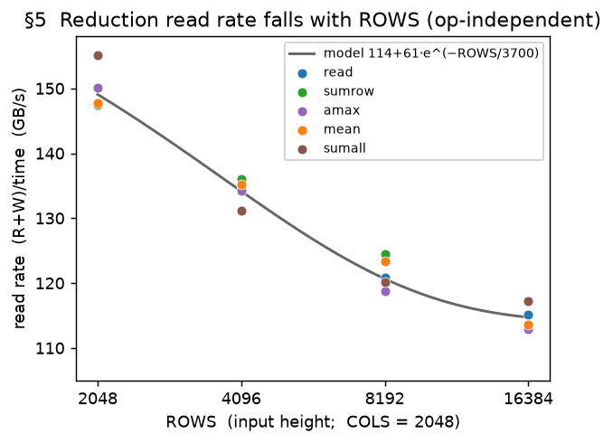

**`sumcol` is the exception.** A reduction over the *outer* axis (`sum(x, dim=0) → [C]`) walks
memory differently and does not show the ROWS falloff; it keeps its own flat access-pattern
rate (~113 GB/s, the `reduce_outer` rate of §6). A cross-core ring combine (when the reduced
axis is split across cores) is provably tiny and carried but inert.

**§5 accuracy.** RMS **2.6 %**, mean +1.3 %, over 58 points — within ~6 % everywhere, across the
full ROWS range now that the falloff is modeled. Representative shapes (repeats omitted):

| op | R×C | measured µs | predicted µs | err % |
|---|---|---:|---:|---:|
| `read` | 2048×1024 | 30.1 | 29.9 | −0.6 |
| `read` | 2048×2048 | 57.6 | 58.0 | +0.8 |
| `read` | 2048×2048 | 59.5 | 58.0 | −2.5 |
| `read` | 2048×4096 | 112.8 | 114.3 | +1.4 |
| `read` | 2048×8192 | 222.9 | 226.8 | +1.8 |
| `read` | 4096×2048 | 128.2 | 129.0 | +0.6 |
| `read` | 8192×1024 | 144.7 | 147.7 | +2.1 |
| `read` | 8192×2048 | 281.8 | 286.8 | +1.8 |
| `read` | 8192×4096 | 545.1 | 564.9 | +3.6 |
| `read` | 16384×2048 | 600.9 | 603.2 | +0.4 |
| `sumrow` | 2048×1024 | 30.6 | 29.9 | −2.4 |
| `sumrow` | 2048×2048 | 58.8 | 58.0 | −1.3 |
| `sumrow` | 2048×4096 | 111.4 | 114.3 | +2.6 |
| `sumrow` | 2048×8192 | 220.5 | 226.8 | +2.9 |
| `sumrow` | 4096×2048 | 127.2 | 129.0 | +1.4 |
| `sumrow` | 8192×1024 | 139.8 | 147.7 | +5.7 |
| `sumrow` | 8192×2048 | 277.0 | 286.8 | +3.5 |
| `sumrow` | 8192×4096 | 534.5 | 564.9 | +5.7 |
| `sumrow` | 16384×2048 | 610.6 | 603.2 | −1.2 |
| `amax` | 2048×2048 | 57.6 | 58.0 | +0.8 |
| `amax` | 2048×8192 | 219.7 | 226.8 | +3.3 |
| `amax` | 4096×2048 | 128.9 | 129.0 | +0.1 |
| `amax` | 8192×1024 | 146.6 | 147.7 | +0.8 |
| `amax` | 8192×2048 | 291.4 | 286.8 | −1.6 |
| `amax` | 8192×4096 | 556.8 | 564.9 | +1.4 |
| `amax` | 16384×2048 | 612.7 | 603.2 | −1.6 |
| `mean` | 2048×2048 | 58.8 | 58.0 | −1.4 |
| `mean` | 2048×8192 | 218.9 | 226.8 | +3.6 |
| `mean` | 4096×2048 | 127.9 | 129.0 | +0.8 |
| `mean` | 8192×1024 | 145.6 | 147.7 | +1.4 |
| `mean` | 8192×2048 | 280.6 | 286.8 | +2.2 |
| `mean` | 8192×4096 | 546.7 | 564.9 | +3.3 |
| `mean` | 16384×2048 | 609.6 | 603.2 | −1.0 |
| `sumall` | 2048×2048 | 54.2 | 56.3 | +3.8 |
| `sumall` | 2048×8192 | 212.2 | 225.1 | +6.1 |
| `sumall` | 4096×2048 | 128.0 | 125.1 | −2.3 |
| `sumall` | 8192×1024 | 139.4 | 139.0 | −0.3 |
| `sumall` | 8192×2048 | 279.3 | 278.1 | −0.4 |
| `sumall` | 8192×4096 | 548.7 | 556.2 | +1.4 |
| `sumall` | 16384×2048 | 572.3 | 584.9 | +2.2 |
| `sumcol` | 2048×2048 | 70.6 | 74.3 | +5.2 |
| `sumcol` | 2048×8192 | 292.9 | 297.1 | +1.4 |
| `sumcol` | 4096×2048 | 145.1 | 148.5 | +2.3 |
| `sumcol` | 8192×2048 | 286.5 | 297.0 | +3.7 |
| `sumcol` | 16384×2048 | 571.9 | 593.9 | +3.9 |

### §6. Transport ops are copies with an access-pattern effective bandwidth

**Observation.** Transport ops — `transpose` and concatenation `cat0`/`cat1` — rearrange data
without arithmetic. In the IR each lowers to a plain byte-copy (a `clone`, the same primitive a
trivial copy emits; we confirmed the recorded op name is `clone`, versus `neg` for a real
pointwise op). So the only thing that distinguishes a transport from a copy is *how it walks
memory*, and that sets its effective bandwidth (the `(R+W)/time` of §4).

**What the data shows (figure).** `transpose` and `cat1` each run at a **stable effective
bandwidth across every shape** — `transpose` ~116 GB/s (±1.5 %), `cat1` ~108. `cat0` and
`transpose_outer` instead **fall with the row width `C`**: a shape sweep at *fixed total bytes*
shows the effective BW drops sharply as `C` grows (e.g. `cat0` runs at 85 GB/s for an
8192×512 operand but 53 for 512×8192 — same bytes, wide vs tall). The likely reason: each output
row is reassembled from the 64-element stick blocks of the inputs — a **shuffle at block
granularity** — so a wider row has more blocks to permute into place, and that per-block shuffle,
not the byte count, sets the cost.

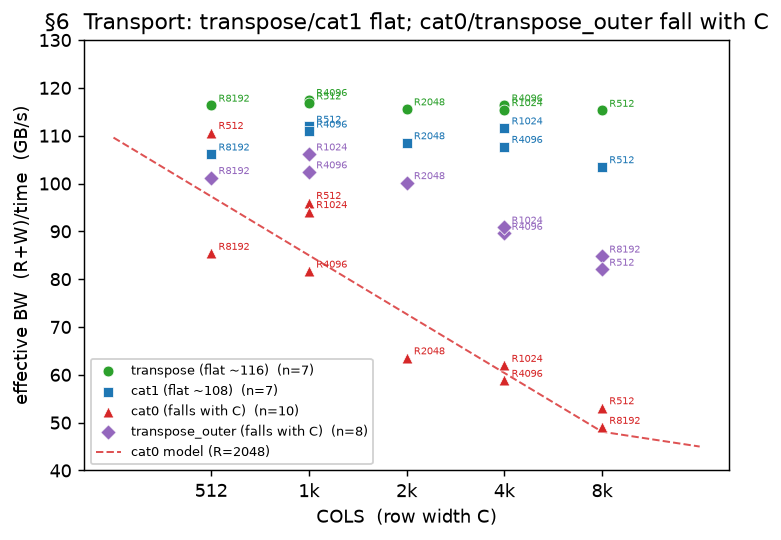

**Model.** Each op gets the rate its access pattern implies, read from the IR:

| op | access pattern | effective BW (GB/s) | model |
|---|---|---|---|
| `transpose` | swaps the 64-block axis with a row axis | **116**, flat | fixed 116 |
| `cat1` | concatenate on the outer axis | ~108, flat | default copy model (§2), ~7 % optimistic |
| `cat0` | concatenate on the 64-block axis | ~110 → ~49, falls with `C` | `252 − 4·log₂R − 12.3·log₂C` (clamped 45–150) |
| `transpose_outer` | 3-D swap of two outer axes | ~106 → ~85, falls with `C` | default copy model; flagged |

`cat0`'s per-block shuffle slows as the row gets wider (more blocks); a fit on the shape sweep
(effective BW linear in `log₂C`, weakly in `log₂R`, R² 0.93 over 10 shapes) captures it and
brings `cat0` from tens of percent off to within ~10 %. `transpose_outer` shows the *same*
`C`-driven falloff, but carries no access-pattern tag in the IR, so it stays on the default copy
model and under-predicts wide-`C` shapes by up to ~22 %. Fixing it is a **future task** — tag
`transpose_outer` in the extractor so it reuses the `cat0` shape model. **Question for review:**
is `transpose_outer` (a 3-D outer transpose) common enough in real workloads to justify that
compiler-side change, or is the ~22 % worst case on a rare op acceptable?

**§6 accuracy.** RMS **8.5 %**, mean −3.3 %, over 42 points. `transpose` is exact (±2 %); the
residual is the shape-dependent copies — `cat0` (modeled, within ~11 % bar one +22 % point at
8192²) and `transpose_outer` (unmodeled, up to −22 %). Representative shapes (repeats omitted):

| op | R×C | measured µs | predicted µs | err % |
|---|---|---:|---:|---:|
| `transpose` | 512×8192 | 146.0 | 144.6 | −0.9 |
| `transpose` | 2048×2048 | 145.5 | 144.6 | −0.6 |
| `transpose` | 4096×1024 | 142.7 | 144.6 | +1.4 |
| `transpose` | 4096×4096 | 575.6 | 578.5 | +0.5 |
| `transpose` | 8192×512 | 143.7 | 144.6 | +0.7 |
| `cat1` | 512×8192 | 243.2 | 215.9 | −11.2 |
| `cat1` | 2048×2048 | 231.0 | 215.9 | −6.5 |
| `cat1` | 4096×4096 | 935.0 | 863.7 | −7.6 |
| `cat1` | 8192×512 | 237.1 | 215.9 | −8.9 |
| `cat0` | 512×512 | 14.2 | 15.0 | +5.3 |
| `cat0` | 1024×1024 | 66.9 | 71.1 | +6.3 |
| `cat0` | 8192×512 | 294.8 | 284.2 | −3.6 |
| `cat0` | 4096×1024 | 308.2 | 314.3 | +2.0 |
| `cat0` | 2048×2048 | 396.6 | 351.6 | −11.3 |
| `cat0` | 1024×4096 | 406.2 | 399.1 | −1.8 |
| `cat0` | 512×8192 | 474.0 | 461.2 | −2.7 |
| `cat0` | 4096×4096 | 1709.4 | 1861.2 | +8.9 |
| `cat0` | 8192×8192 | 8219.3 | 10011.6 | +21.8 |
| `transpose_outer` | 1024×1024 | 316.1 | 320.0 | +1.2 |
| `transpose_outer` | 8192×512 | 1325.9 | 1280.0 | −3.5 |
| `transpose_outer` | 2048×2048 | 1340.0 | 1280.0 | −4.5 |
| `transpose_outer` | 4096×1024 | 1310.6 | 1280.0 | −2.3 |
| `transpose_outer` | 1024×4096 | 1477.1 | 1280.0 | −13.3 |
| `transpose_outer` | 512×8192 | 1635.7 | 1280.0 | −21.7 |
| `transpose_outer` | 4096×4096 | 6010.8 | 5120.0 | −14.8 |
| `transpose_outer` | 8192×8192 | 25324.2 | 20479.8 | −19.1 |

---

## Part III — Matmul: memory *and* compute

A matrix multiply `A[M,K] @ B[K,N] → C[M,N]` is the first op here that can be **compute-bound**
rather than purely memory-bound, and the first with non-trivial dataflow across cores: it
performs `M·N·K` multiply-accumulate operations (MACs) on the systolic array. The planner tiles
the output into an `m × n` grid (it can also split the shared `K` into `k`, but strongly avoids
it), using `m·n·k` cores. Two quantities recur below: the **per-core tile** (`M/m` rows × `N/n`
columns each core computes) and the **HBM bytes read/written**, `R` and `W`.

### §7. Setup: matmul time is not explained by memory traffic alone

**Observation.** For every op in Parts I–II, kernel time was fully accounted for by the bytes
moved. Matmul is different: its measured time is far larger than its HBM bytes would predict
under the copy model, and the excess grows with `M·N·K` — the MAC count — not with the byte
count. A `2048³` matmul moves the same order of bytes as a large copy but takes several times
longer. So matmul needs a second term, a **compute** term, on top of memory.

**Assumption.** We model matmul kernel time as a function of exactly two quantities: the compute
work (the MAC count) and the HBM memory traffic (`R`, `W`) — `T = f(compute, memory)`. Sections
§8–§11 pin down the form of `f`.

**Question.** How do the memory term and the compute term **combine** into one kernel time —
do they simply add, or does the accelerator do them at the same time?

**Strategy.** We build the model one term at a time, each in a regime where that term
dominates: first the memory term (on matmuls with almost no compute), then the compute rate (on
matmuls that are almost all compute), then how the two overlap. Only the compute rate (§9) is
truly isolated — it is fixed by a slope that does not depend on the other terms. The memory rate
(§8) and the overlap factor (§10) are correlated and were co-fit.

### §8. The memory term — measured on compute-free matmuls

**Isolation.** To measure the memory term alone, use matmuls where compute is negligible: a
very thin `K` (the output dominates → **write-heavy**) and a very thin `M` (large operands, tiny
output → **read-heavy**).

**Model.** In these compute-free corners the kernel runs at or below the §1 copy peak of
150 GB/s, and the read and write corners do not separate into distinct rates. So the memory term
is the §2 form with a single rate:

```
memory = (R + W) / 150 + α·min(R,W)    (α = 0.00574 ns/B)
```

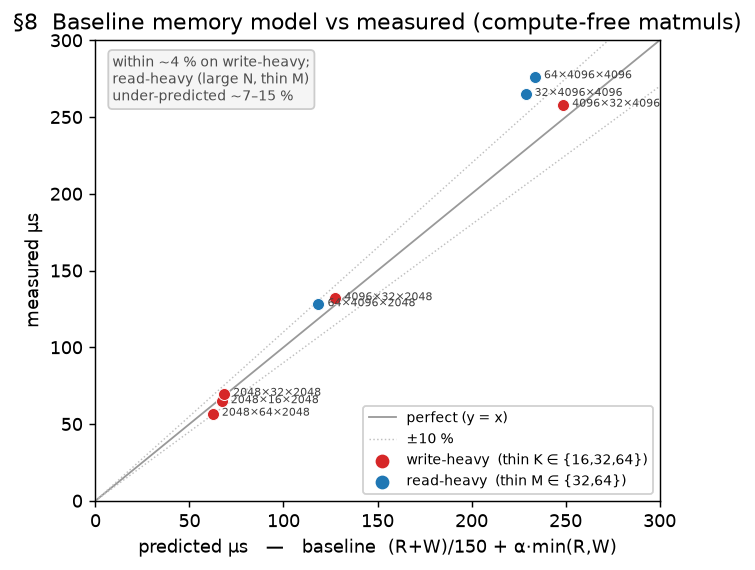

**Accuracy.** On the compute-free sweep (write-heavy `K ∈ {16,32,64}`, read-heavy `M ∈ {32,64}`,
`N` up to 4096) this baseline predicts the **write-heavy** corner to within ~4 %, but
**under-predicts the read-heavy corner — the large-`N`, thin-`M` shapes — by ~7–15 %** (figure):
there the read runs a little below the copy peak, plus a small fixed floor at tiny `M`. That
residual is minor next to the compute term that dominates real matmuls (§9), so it is carried
in the memory term rather than fit away.

### §9. The compute term — its form and rate

**Observation.** With the memory term (§8) subtracted, the leftover time is compute. We model it
as **perfect parallelism**: each core does an equal `1/cores` share of the `MACs` at the same
rate, so compute time is expected to be **linear in `1/cores`** (double the cores → half the
time) and linear in the MAC count (double `K` → double the time):

```
compute = MACs / cores / peak       (MACs = M·N·K,  cores = m·n·k)
```

Here `peak` is a modeled **hardware compute ceiling** — the sustained number of
multiply-accumulates one core's systolic array retires per nanosecond (MAC/ns) — a single
constant we fit below. (Reaching `peak` needs enough per-core rows to fill the array; a
fill efficiency `pt_eff = min(1, (rows/64)^0.35) ≤ 1` captures the shortfall, and it is ≈ 1 for
every large matmul here — which is why this section can quote `compute = MACs/cores/peak`
unqualified.)

**Time tracks cores, not the split.** The `cores` in the denominator is the *product* `m·n`
(the planner keeps `K` whole), not the particular factoring. The figure confirms this directly:
at 32 cores the balanced splits `4×8`, `8×4`, `2×16` land on the same ~385 µs.

**Fitting `peak`, cleanly.** `peak` is the **slope** of kernel time against `1/cores` at a fixed
matmul — and a slope is immune to any constant offset, including the overlap term of §10. So
unlike the memory rate, `peak` is pinned without circularity. Two problem sizes (`K = 2048` and
`4096` at `M=N=2048`) swept over cores 4→32 give straight lines through near-zero intercepts —
and the `K=4096` slope is twice the `K=2048` slope, matching the 2× MAC count. The fitted
`peak ≈ 1140–1160 MAC/ns/core` predicts these to **2–3 %**; its absolute level is *mildly*
correlated with the overlap factor (`peak = 1200` with the same overlap fits nearly as well), so
we quote a small range, not a spuriously exact number.

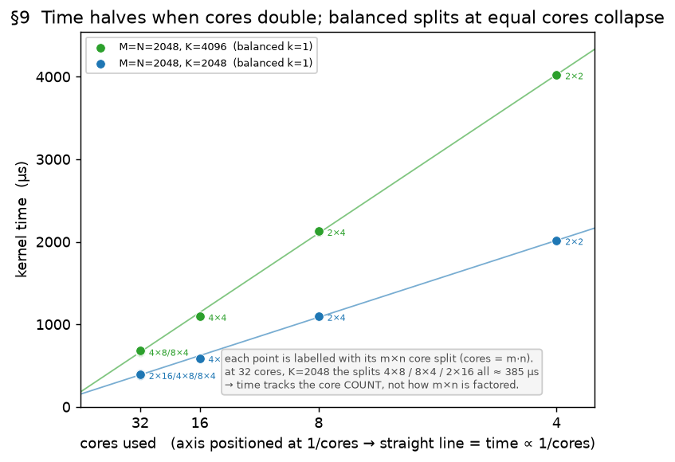

### §10. Compute and memory overlap — they do not simply add

**Observation.** Adding the two terms (`T = compute + memory`) **over-predicts** balanced
matmuls: the real kernel is faster than the sum. The array computes while the next operands
stream in, so the two phases run partly concurrently — at most the *shorter* one can hide inside
the longer, capping the saving at `min(compute, memory)`.

**Model.** Overlap a fixed fraction `γ` of that cap:

```
T = compute + memory − γ·min(compute, memory)
```

`γ=0` is serial; `γ=1` is a fully pipelined array (`T = max(compute, memory)`). The fit lands
`γ ≈ 0.46` — about half the shorter phase hidden. Why only half? Pipeline **fill and drain** can't
overlap (the first load has nothing to compute against, the last compute nothing to stream), and
that overhead grows as each core's pipeline shortens: for `2048×2048×2048` the hidden fraction
falls `0.64 → 0.49 → 0.35` as cores go `4 → 8 → 32`. A single `γ` is a compromise across core
counts; an `L`-dependent γ is the natural refinement (a queued core-count sweep, see the appendix).

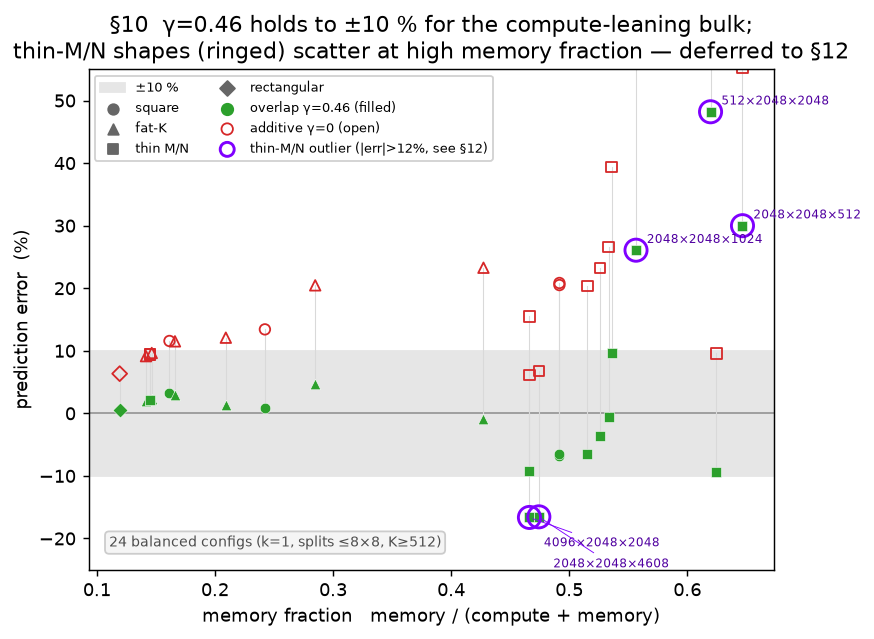

**Where it holds, and the outliers.** The figure plots each balanced matmul's error against its
**memory fraction** `memory / (compute + memory)`. For the compute-leaning bulk (fraction ≲ 0.45)
the additive model (`γ=0`, open) over-predicts more and more as memory grows, up to +40 %, and
`γ=0.46` (filled) flattens it to **±10 % across every shape class**. The remaining outliers
(ringed, |error| > 12 %) are **all thin-M/N** shapes: `512×2048×2048` (+48 %), `2048×2048×512`
(+30 %), `2048×2048×1024` (+26 %), and non-pow2 `2048×2048×4608` (−17 %). These are the same
thin-operand shapes flagged in §8 — the error there is the memory/tile term, not overlap, so we
resolve them in **§12** rather than distort γ to chase them. (Two families are filtered out of
this figure entirely: lopsided splits `1×32`/`16×2` (−40…−47 %, the split model) and tiny-`K`
matmuls (near-pure memory) — both §12's.)

### §11. A residual: when the operand tile overflows on-chip memory

**Observation.** With the memory (§8), compute (§9), and overlap (§10) terms in place — the full
base model, minus this section's term — balanced high-core matmuls still leave a residual that
**grows once the per-core output tile overflows on-chip capacity**. That tile is the accumulator
of area `(M/m)·(N/n)`; the figure grows it with two `4×8`-split sweeps (one raises `M/m` at
`N/n = 256`, the other raises `N/n` at `M/m = 512`) and plots both against the tile **size in
bytes**. The residual (measured − base model) sits near zero while the tile fits and climbs
steeply once the size passes ~128 KB/core (64K fp16 elements), reaching +277 µs (+17 %) at the
largest tile. That is the signature of running out of on-chip room.

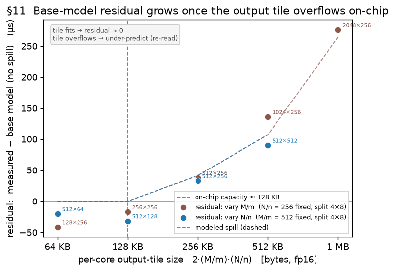

**Model.** Once the per-core output tile overflows on-chip capacity, both operands must be
re-streamed from HBM for reuse — extra traffic we call **spill**. The re-read *magnitude* is the
operand bytes; the *fraction* re-read grows with how far the tile overflows the capacity knee
(`area` in elements; `65536` elems = 128 KB at fp16):

```
spill = (|A| + |B|)·f(area),   area = (M/m)·(N/n),
f(area) = min(1.50, max(0, 0.45·log₂(area / 65536)))
```

charged at the read rate. The knee at ~128 KB/core is the on-chip accumulator capacity — a
single, physical threshold on the tile *as a whole*, not a separate limit per edge.

**Residuals.** Two small ones remain: at equal area an elongated tile costs a little more than a
square one (a shape dependence the area-only form omits), and very *small* tiles are slightly
*over*-predicted by the opposite-sign under-fill/overhead floor of §12. Neither matters much for
what this term is *for*: we only need a large tile to carry a **reasonable, growing** cost so the
compiler is steered away from over-large per-core tiles — which the spill term now does.

### §12. Where the base model breaks: out-of-regime residuals

The base model (§8–§11) predicts **planner-realistic** matmuls — those a real compiler would
emit (K kept whole, each fanout ≤ 8, non-tiny) — to **RMS ~5.8 %** (mean ≈ 0). Two departures
leave larger errors; both sit outside what a planner emits.

- **§12a. Extreme splits (one fanout ≫ 8).** A lopsided split makes an operand's per-core tile
  huge and re-read from HBM by many cores, **under-predicting by 35–47 %** (`16×2`, `32×1`, `1×32`).
  The effect is **edge-asymmetric** — a huge `N/n` breaks it, a huge `M/m` (e.g. `2×16`) is fine
  (extra rows just stream) — so the area-only spill term (§11) structurally cannot express it. It
  costs little in practice: a planner keeps both fanouts moderate. **Question for review:** does
  this case warrant a deeper dive, or is it fine to leave unmodeled?
- **§12b. Tiny / thin matmuls.** Sub-10-µs kernels sit on a fixed per-kernel overhead the model
  zeroes, **under-predicting by up to −34 %**; a few thin, memory-heavy shapes (small `M`/`N`)
  *over*-predict by up to **+48 %** (the small-tile / underfill residual of §10–§11). Both are
  bounded and off the real-workload path. **Question for review:** do these edge shapes warrant a
  deeper dive, or is it fine to leave them flagged?

**Part III accuracy — matmul, by regime.** The planner-realistic bulk is within a few percent;
the out-of-regime rows carry the large, mechanism-named errors above.

| regime | n | RMS % | mean % | err range | status |
|---|---:|---:|---:|---|---|
| planner-realistic (K whole, fanout ≤ 8, non-tiny) | 35 | **5.8** | +3.1 | −7…+19 | modeled |
| extreme split (one fanout ≫ 8 → huge tile) | 10 | 25.0 | −18.3 | −44…−1 | §12a: edge-asymmetric re-read; area-based spill can't fit |
| tiny / thin (K ≤ 128 or min(M,N) ≤ 512) | 17 | 22.0 | +4.1 | −34…+48 | §12b: fixed-overhead floor + thin-shape residual |

Representative planner-realistic points (the regime the model is built for):

| M×K×N | split (m×n×k) | measured µs | predicted µs | err % |
|---|---|---:|---:|---:|
| 2048×2048×2048 | 2×2×1 (cores 4) | 2013.5 | 2091.0 | +3.8 |
| 2048×2048×2048 | 2×4×1 (cores 8) | 1095.9 | 1140.0 | +4.0 |
| 2048×2048×2048 | 4×8×1 (cores 32) | 384.4 | 393.4 | +2.3 |
| 4096×2048×2048 | 4×8×1 (cores 32) | 806.1 | 781.2 | −3.1 |
| 8192×2048×2048 | 4×8×1 (cores 32) | 1594.2 | 1582.0 | −0.8 |
| 2048×4096×2048 | 4×8×1 (cores 32) | 667.1 | 702.3 | +5.3 |
| 2048×2048×4096 | 4×8×1 (cores 32) | 764.0 | 781.2 | +2.2 |

**Every matmul data point** (62 runs; `regime` = which row of the summary table above):

| regime | M×K×N | split (m×n×k) | meas µs | pred µs | err % |
|---|---|---|---:|---:|---:|
| `realistic` | 2048×2048×1024 | 4×8×1 | 167.6 | 199.5 | +19.0 |
| `realistic` | 1024×2048×2048 | 4×8×1 | 182.0 | 199.5 | +9.6 |
| `realistic` | 2048×2048×2048 | 8×4×1 | 383.4 | 393.4 | +2.6 |
| `realistic` | 2048×2048×2048 | 4×8×1 | 384.4 | 393.4 | +2.3 |
| `realistic` | 2048×2048×2048 | 4×8×1 | 384.9 | 393.4 | +2.2 |
| `realistic` | 2048×2048×2048 | 4×8×1 | 390.1 | 393.4 | +0.8 |
| `realistic` | 1024×2048×1024 | 2×2×1 | 506.5 | 542.4 | +7.1 |
| `realistic` | 2048×4096×2048 | 4×8×1 | 667.1 | 702.3 | +5.3 |
| `realistic` | 2048×4096×2048 | 4×8×1 | 668.0 | 702.3 | +5.1 |
| `realistic` | 2048×2048×4096 | 4×8×1 | 764.0 | 781.2 | +2.2 |
| `realistic` | 2048×2048×4096 | 4×8×1 | 770.3 | 781.2 | +1.4 |
| `realistic` | 4096×2048×2048 | 4×8×1 | 806.1 | 781.2 | -3.1 |
| `realistic` | 4096×2048×2048 | 4×8×1 | 810.3 | 781.2 | -3.6 |
| `realistic` | 4096×2048×2048 | 8×4×1 | 831.5 | 781.2 | -6.0 |
| `realistic` | 2048×2048×4608 | 4×8×1 | 944.1 | 879.5 | -6.8 |
| `realistic` | 1024×4096×1024 | 2×2×1 | 1006.3 | 1070.7 | +6.4 |
| `realistic` | 2048×4096×2048 | 4×4×1 | 1093.4 | 1227.6 | +12.3 |
| `realistic` | 2048×2048×2048 | 2×4×1 | 1093.8 | 1140.0 | +4.2 |
| `realistic` | 2048×4096×2048 | 4×4×1 | 1094.5 | 1227.6 | +12.2 |
| `realistic` | 2048×2048×2048 | 2×4×1 | 1095.9 | 1140.0 | +4.0 |
| `realistic` | 8192×2048×2048 | 4×8×1 | 1594.2 | 1582.0 | -0.8 |
| `realistic` | 8192×2048×2048 | 4×8×1 | 1594.3 | 1582.0 | -0.8 |
| `realistic` | 8192×2048×2048 | 8×4×1 | 1614.7 | 1582.0 | -2.0 |
| `realistic` | 2048×2048×2048 | 2×2×1 | 2013.5 | 2091.0 | +3.8 |
| `realistic` | 2048×2048×2048 | 2×2×1 | 2014.9 | 2091.0 | +3.8 |
| `realistic` | 2048×4096×2048 | 2×4×1 | 2123.7 | 2223.8 | +4.7 |
| `realistic` | 2048×4096×2048 | 2×4×1 | 2125.0 | 2223.8 | +4.7 |
| `realistic` | 2048×4096×2048 | 2×4×1 | 2125.7 | 2223.8 | +4.6 |
| `realistic` | 2048×4096×2048 | 2×2×1 | 4021.0 | 4125.7 | +2.6 |
| `realistic` | 2048×4096×2048 | 2×2×1 | 4021.2 | 4125.7 | +2.6 |
| `realistic` | 2048×4096×2048 | 2×2×1 | 4022.1 | 4125.7 | +2.6 |
| `realistic` | 2048×4096×2048 | 2×2×1 | 4024.2 | 4125.7 | +2.5 |
| `realistic` | 2048×2048×4096 | 2×2×1 | 4026.8 | 4106.4 | +2.0 |
| `realistic` | 4096×2048×2048 | 2×2×1 | 4027.0 | 4106.4 | +2.0 |
| `realistic` | 4096×2048×4096 | 2×2×1 | 8045.1 | 8061.8 | +0.2 |
| `extreme` | 64×4096×2048 | 1×32×1 | 127.9 | 126.5 | -1.0 |
| `extreme` | 32×4096×4096 | 1×32×1 | 264.9 | 238.8 | -9.9 |
| `extreme` | 64×4096×4096 | 1×32×1 | 276.4 | 249.6 | -9.7 |
| `extreme` | 2048×2048×2048 | 2×16×1 | 399.4 | 393.4 | -1.5 |
| `extreme` | 4096×2048×2048 | 2×16×1 | 811.1 | 781.2 | -3.7 |
| `extreme` | 4096×2048×2048 | 32×1×1 | 1202.7 | 781.2 | -35.0 |
| `extreme` | 4096×2048×2048 | 16×2×1 | 1222.8 | 781.2 | -36.1 |
| `extreme` | 4096×2048×2048 | 1×32×1 | 1381.8 | 781.2 | -43.5 |
| `extreme` | 8192×2048×2048 | 2×16×1 | 1632.6 | 1582.0 | -3.1 |
| `extreme` | 8192×2048×2048 | 16×2×1 | 2632.8 | 1582.0 | -39.9 |
| `tiny` | 512×64×512 | 4×8×1 | 5.3 | 5.4 | +2.2 |
| `tiny` | 512×64×512 | 4×4×1 | 7.5 | 5.6 | -24.7 |
| `tiny` | 512×64×512 | 2×4×1 | 8.4 | 6.1 | -27.6 |
| `tiny` | 768×64×768 | 2×4×1 | 14.1 | 12.6 | -10.3 |
| `tiny` | 768×64×768 | 4×4×1 | 17.3 | 11.4 | -34.0 |
| `tiny` | 512×512×1024 | 4×8×1 | 20.3 | 27.5 | +35.0 |
| `tiny` | 256×2048×512 | 4×8×1 | 26.0 | 28.2 | +8.4 |
| `tiny` | 1024×128×2048 | 4×8×1 | 31.5 | 41.7 | +32.5 |
| `tiny` | 2048×64×2048 | 4×8×1 | 56.6 | 68.0 | +20.2 |
| `tiny` | 2048×16×2048 | 4×8×1 | 64.7 | 68.6 | +6.0 |
| `tiny` | 2048×32×2048 | 4×8×1 | 69.6 | 71.2 | +2.4 |
| `tiny` | 512×2048×2048 | 4×8×1 | 86.2 | 127.7 | +48.2 |
| `tiny` | 1792×64×3584 | 4×8×1 | 104.5 | 103.6 | -0.9 |
| `tiny` | 2048×2048×512 | 4×8×1 | 107.4 | 127.7 | +19.0 |
| `tiny` | 1792×2048×512 | 4×8×1 | 125.2 | 113.5 | -9.3 |
| `tiny` | 4096×32×2048 | 4×8×1 | 131.8 | 134.0 | +1.7 |
| `tiny` | 4096×32×4096 | 4×8×1 | 257.9 | 261.5 | +1.4 |

---

## Part IV — Coarse tiling: fitting intermediates in on-chip memory

A *coarse-tiled* program fuses a chain of ops into **one** kernel and tiles a dimension so that,
within each tile, the intermediate tensors are small enough to live in on-chip scratchpad (LX)
instead of off-chip memory (HBM). Two examples: `softmax(x)` (the chain `max → sub → exp → sum →
div`) and a tiled `a @ b`. This part shows the cost of such a kernel needs **no new form** — it
is the Parts I–III model applied to a byte count that depends on where each tensor lives.

### §13. The whole model is one question: which tensors are in HBM, which in LX?

The accelerator has two memories: **HBM** (off-chip — the bandwidth every Part so far has
modeled) and **LX** (a small on-chip scratchpad). In the traffic model, an LX-resident tensor is
**free** — it never crosses the HBM bus — while an HBM tensor is charged at the Part I–III rates.
So a fused kernel's cost is set entirely by **which tensors sit in HBM**:

```
HBM bytes = every external input (counted once) + every output + every intermediate that spilled to HBM
LX intermediates = free
```

The model reads this straight from the IR: each tensor carries its residency (HBM or LX). It
sums the HBM ones — deduplicating a shared external input, which a fused kernel loads once and
re-serves on-chip — and ignores the LX ones. That is the entire coarse-tiling model.

**Why tiling helps.** Untiled, softmax's two full-size intermediates live in HBM (~7 passes over
the data); tiling the rows finely enough moves them into LX, leaving only the input and output in
HBM (2 passes). The byte-counting model follows the drop:

| tiles | intermediates in | HBM passes | measured µs | predicted µs | err % |
|---:|---|---:|---:|---:|---:|
| 1 (untiled) | HBM | 7.0 | 9927 | 9861 | −1 |
| 2 | HBM (spilled) | 4.5 | 9735 | 8006 | −18 |
| 4 | LX | 2.0 | 3143 | 3318 | +6 |
| 8 | LX | 2.0 | 2867 | 2990 | +4 |
| 16 | LX | 2.0 | 2649 | 2695 | +2 |
| 32 | LX | 2.0 | 2683 | 2695 | +0 |

(The `tiles=2` row still carries the deepest residual, and the `§14` bandwidth derate is what
lifts its prediction from the old −40 % toward −18 %.)

### §14. The LX-spill boundary: spilled traffic runs slower than peak

**Observation.** The byte count is accurate at both ends — fully untiled (all intermediates in
HBM, ~7 passes) and finely tiled (all in LX, 2 passes) — but **under-predicts by up to 40 % in
the transition between them**. The error is not random: it grows with the per-core **working
set** — the live intermediate bytes each core holds, `≈ 2 × (rows/core) × COLS × 2 B`.

| per-core working set | effective BW | err % | verdict |
|---:|---:|---:|---|
| ~4.2 MB | ~62 GB/s | **−40** | spills; runs at ~⅔ peak |
| ~2.1 MB | ~84 GB/s | −13…−18 | partial spill |
| ~1.0 MB | ~90 GB/s | −5…−13 | over capacity — mild |
| ≤ 0.5 MB | ~100 GB/s | −7…+4 | fits — model correct |

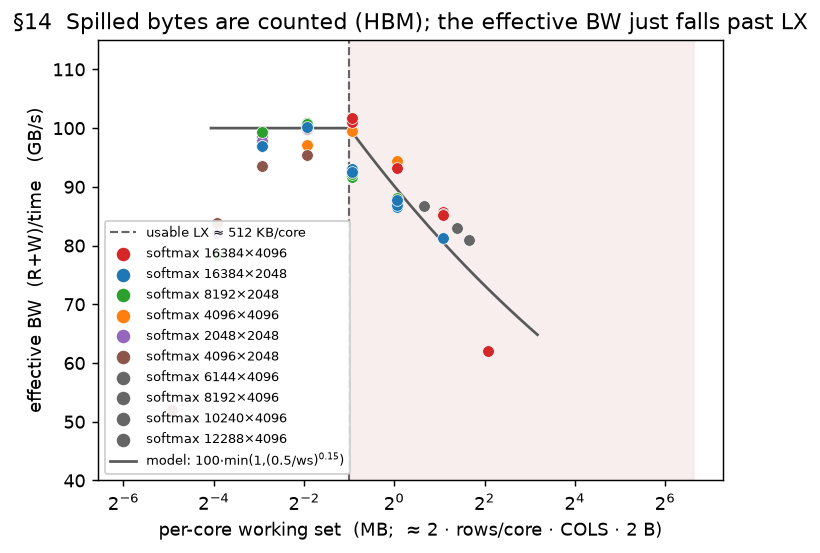

**It is a rate effect, not a byte miss.** The tempting story is that the spilled intermediates go
uncounted. They do not: at the spilling end the extractor already tags them **HBM** and counts
them (the ~4 MB/core case reads + writes ~600 MB). Yet the model still over-predicts the
*bandwidth* — it assumes the ~100 GB/s balanced-softmax rate, but the **effective bandwidth falls
as the working set overflows**, down to ~62 GB/s. So the spilled bytes are right; they just run
slower. (The untiled `tiles=1` case, with the largest working set of all, fits to −1 % — because
it is HBM *by design* and streams at the normal rate; only the *tiled-but-overflowing* regime is
slow.)

**Experiment / evidence.** The tile sweep, repeated at three shapes, collapses onto the working
set: effective BW is ~100 GB/s while it fits and falls smoothly once past **~512 KB/core** — the
*same* threshold for every shape. That threshold matches the **practically available** LX
independently (the raw scratchpad may be larger, but only ~512 KB/core is usable before spill
overhead).

**Model.** Derate the bandwidth for a coarse-tiled kernel whose per-core working set overflows LX
(`cap ≈ 512 KB`); the bytes stay counted, only the rate drops:

```
ws/core = 2 · (rows/core) · COLS · 2 B ;
BW  ×=  min(1, (cap / ws)^0.15)          for ws > cap   (else 1)
```

This cuts the coarse-tiling (softmax) error from **RMS 11.0 % to 5.7 %** and the worst spill point
from −40 % to −18 %. It is calibrated on softmax and gated to non-matmul coarse tiling; the
residual −18 % at the deepest overflow (8× capacity) is the one point the single exponent
under-derates.

### §15. Underfill: a short per-core tile runs the pipeline below peak — the `eff` term

**Observation.** Once the intermediates fit in LX (§14), a coarse-tiled kernel's speed still
depends on the **per-core tile height** — the rows each core streams per tile,
`h = ROWS / (cores · tiles)`: with too few rows the **effective bandwidth drops**. Sweeping the
tile count on softmax (isolating the LX-fitting points), the effective bandwidth climbs from
~48 GB/s at a 2-row tile (`h = 2`) to a ~150 GB/s plateau by `h ≈ 16`, then mildly declines
(figure).

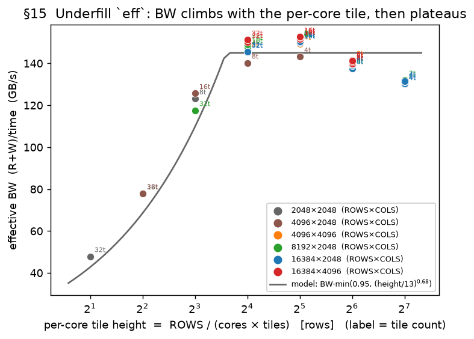

**Model (calibrated).** A pipeline-fill efficiency `eff ≤ 1` multiplies the memory term, keyed on
the per-core tile height `h = ROWS / (cores · tiles)`:

```
eff = min(0.95,  (h / 13)^0.68)          memory term = (R + W) / BW_eff / eff
```

It plateaus at 0.95 by `h ≈ 16` and derates below (≈0.45 at `h = 4`, ≈0.28 at `h = 2`). A
cross-`COLS` control (same `h`, double the tile bytes → same per-byte cost) confirmed it keys
on **rows (`h`), not tile bytes**. **On the softmax regime where the intermediates fit LX, this
gives RMS 5.9 %** (mean −1.2 %, over 45 points) — the coarse-tiling model is accurate once §14's
spill is set aside.

**Two residuals, both left unmodeled.** (1) Above `h ≈ 32` the efficiency mildly declines
(150 → 131 GB/s) while the model holds the 0.95 cap — a small, rows-driven droop. (2) A **tiled
matmul** (`matmul_row_tiling`) appears to underfill on *compute* the way softmax underfills on
memory — beyond a few tiles its time climbs as each tile gets fewer rows — but the available data
is thin, non-current, and partly non-monotonic, so it is **flagged, not modeled** (tiled matmuls
take `pt_eff = 1`; a clean tile-count sweep is queued). It is the −15 % `matmul_row` row in the
table below.

### Part IV data — every coarse-tiling run

Both coarse ops, all current-image runs (`softmax_row_tiling` fits the §13–§15 model; the
`matmul_row_tiling` rows are the unmodeled tiled-underfill residual just noted):

| op | shape | tiles | runs | meas µs | pred µs | err % |
|---|---|---:|---:|---:|---:|---:|
| `matmul` | 2048×2048×2048 | 2 | 1 | 341 | 358 | +5 |
| `matmul` | 2048×2048×2048 | 4 | 1 | 440 | 358 | -19 |
| `matmul` | 2048×2048×2048 | 8 | 1 | 652 | 358 | -45 |
| `matmul` | 2048×2048×4096 | 2 | 1 | 752 | 720 | -4 |
| `matmul` | 2048×2048×4096 | 4 | 1 | 724 | 685 | -5 |
| `matmul` | 2048×2048×4096 | 8 | 1 | 1123 | 685 | -39 |
| `matmul` | 4096×2048×2048 | 2 | 1 | 776 | 713 | -8 |
| `matmul` | 4096×2048×2048 | 4 | 1 | 677 | 685 | +1 |
| `matmul` | 4096×2048×2048 | 8 | 1 | 872 | 685 | -21 |
| `softmax` | 2048×2048 | 4 | 1 | 172 | 168 | -2 |
| `softmax` | 2048×2048 | 8 | 1 | 204 | 223 | +9 |
| `softmax` | 2048×2048 | 16 | 1 | 323 | 357 | +10 |
| `softmax` | 2048×2048 | 32 | 1 | 526 | 571 | +9 |
| `softmax` | 4096×2048 | 4 | 1 | 352 | 337 | -4 |
| `softmax` | 4096×2048 | 8 | 1 | 359 | 337 | -6 |
| `softmax` | 4096×2048 | 16 | 1 | 400 | 445 | +11 |
| `softmax` | 4096×2048 | 32 | 1 | 646 | 713 | +10 |
| `softmax` | 4096×4096 | 2 | 1 | 711 | 747 | +5 |
| `softmax` | 4096×4096 | 4 | 1 | 675 | 674 | -0 |
| `softmax` | 4096×4096 | 8 | 1 | 691 | 674 | -2 |
| `softmax` | 6144×4096 | 2 | 1 | 1160 | 1192 | +3 |
| `softmax` | 8192×2048 | 2 | 1 | 762 | 747 | -2 |
| `softmax` | 8192×2048 | 4 | 2 | 730 | 674 | -8 |
| `softmax` | 8192×2048 | 8 | 8 | 667 | 674 | +1 |
| `softmax` | 8192×2048 | 16 | 2 | 679 | 674 | -1 |
| `softmax` | 8192×2048 | 32 | 1 | 856 | 890 | +4 |
| `softmax` | 8192×4096 | 2 | 1 | 1574 | 1659 | +5 |
| `softmax` | 10240×4096 | 2 | 1 | 2020 | 2144 | +6 |
| `softmax` | 12288×4096 | 2 | 1 | 2487 | 2644 | +6 |
| `softmax` | 16384×2048 | 1 | 1 | 4956 | 4930 | -1 |
| `softmax` | 16384×2048 | 2 | 1 | 1653 | 1659 | +0 |
| `softmax` | 16384×2048 | 4 | 3 | 1541 | 1495 | -3 |
| `softmax` | 16384×2048 | 8 | 3 | 1444 | 1347 | -7 |
| `softmax` | 16384×2048 | 16 | 4 | 1340 | 1347 | +1 |
| `softmax` | 16384×2048 | 32 | 2 | 1384 | 1347 | -3 |
| `softmax` | 16384×4096 | 1 | 1 | 9927 | 9861 | -1 |
| `softmax` | 16384×4096 | 2 | 2 | 9735 | 8006 | -18 |
| `softmax` | 16384×4096 | 4 | 2 | 3143 | 3318 | +6 |
| `softmax` | 16384×4096 | 8 | 2 | 2867 | 2990 | +4 |
| `softmax` | 16384×4096 | 16 | 3 | 2649 | 2695 | +2 |
| `softmax` | 16384×4096 | 32 | 1 | 2683 | 2695 | +0 |

---

### Appendix — reproducibility

- **Offline scoring:** `notes/eval_model.py` recomputes accuracy for any model version from
  the stored `(features, measured_time)` dataset — no hardware. `--params k=v` re-scores a
  proposed parameter instantly.
- **Figures:** `notes/plot_report.py` regenerates every figure from `sweep_records.json`.
- **Sweeps:** each section's data comes from the profiling sweeps under
  `docs/source/user_guide/examples/` (a master runner chains them and folds the results into
  `sweep_records.json`).
